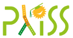

    

        

            
        

        

            <h2>Programming Language Implementation Summer School 2019</h2>
            <h3>May 19–24, 2019 in Bertinoro, Italy</h3>

            

            <i>Programming languages are our interface to the myriad of computer systems we
            interact with on a daily basis. They allow us to craft complex sequences of
            operations at increasing high levels of abstraction. How are these languages
            designed? How are they implemented? How do we evaluate them?</i>
            

            
            

            The Summer School's goal is to prepare early graduate students and advanced
            undergraduates for research in the field. This will be done through a
            combination of lectures on language implementation techniques and short talks
            exploring the state of the art in programming language research and practice.
            

            
            

            More information at <a href="https://pliss2019.github.io">https://pliss2019.github.io</a>.
            

        

    

    

        

    

    

        

            
        

        

            <h2>Programming Language Implementation Summer School 2017</h2>
            <h3>May 20–27, 2017 in Bertinoro, Italy</h3>

            

            Programming languages play a central role in computing, yet it is often unclear
            to prospective students what are the open problems and what careers are
            available to them. The First Implementation Summer School of Programming
            Language offer prospective students a mixture of short courses teaching
            important concepts in the field of programming languages, and lectures
            highlighting open problems and cutting edge techniques in academia and industry.
            

            
            

            More information at <a href="https://prl-prg-ss.github.io">https://prl-prg-ss.github.io</a>.
            

