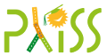

    

        

            
        

        

            <h2>Programming Language Implementation Summer School</h2>

            

            <i>Programming languages are our interface to the myriad of computer systems we
            interact with on a daily basis. They allow us to craft complex sequences of
            operations at increasing high levels of abstraction. How are these languages
            designed? How are they implemented? How do we evaluate them?</i>
            

            
PLISS prepares students for advanced study in the field through a combination of lectures on language implementation techniques, exploring the state of the art in programming language research and practice, and mentoring sessions.

        

    

    

        

    

    

        

        

        

            <h3>PLISS 2026 &mdash; May 25-30, 2026 in Bertinoro, Italy</h3>
            

            More information at <a href="https://pliss.org/2026/">https://pliss.org/2026/</a>.
            

        

    

    

        

    

    

        

        

        

            <h3>PLISS 2025 &mdash; May 26-31, 2025 in Bertinoro, Italy</h3>
            

            More information at <a href="https://pliss.org/2025/">https://pliss.org/2025/</a>.
            

        

    

    

        

    

    

        

        

        

            <h3>PLISS 2023 &mdash; September 3-9, 2023 in Bertinoro, Italy</h3>
            

            More information at <a href="https://pliss.org/2023/">https://pliss.org/2023/</a>.
            

        

    

    

        

    

    

        

        

        

            <h3>PLISS 2022 &mdash; October 24-29, 2022 in Bertinoro, Italy</h3>
            

            More information at <a href="https://pliss.org/2022/">https://pliss.org/2022/</a>.
            

        

    

    

        

    

    

        

        

        

            <h3>PLISS 2021 &mdash; May-June 2021, online</h3>
            

            More information at <a href="https://pliss.org/2021/">https://pliss.org/2021/</a>.
            

        

    

    

        

    

    

        

        

        

            <h3>PLISS 2019 &mdash; May 19–24, 2019 in Bertinoro, Italy</h3>
            

            More information at <a href="https://pliss2019.github.io">https://pliss2019.github.io</a>.
            

        

    

    

        

    

    

        

        

        

            <h3>PLISS 2017 &mdash; May 20–27, 2017 in Bertinoro, Italy</h3>
            

            More information at <a href="https://pliss2017.github.io">https://pliss2017.github.io</a>.
            

        

    

