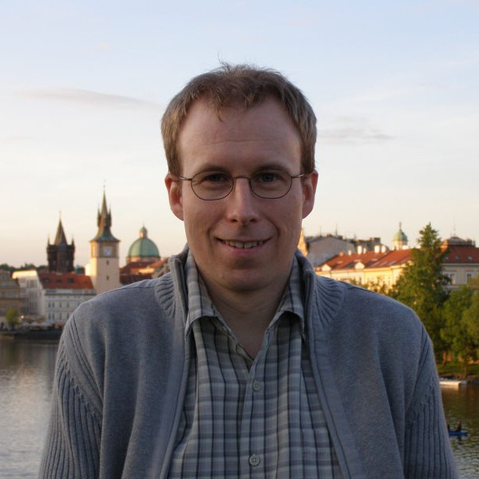

<h2>Tomáš Kalibera (1978&ndash;2026)</h2>

Tomáš Kalibera, a member of R Core, died peacefully on April 1, 2026, in Prague, after a short illness. He was 48. The previous afternoon he had been with old friends&nbsp;&mdash; lucid, characteristically understated, himself.

He leaves behind his wife Anna, his young son Filip, and both his parents, Jiří and Eva.

I write this as someone who worked with Tomáš for eighteen years, and who had the privilege of watching him grow from a talented academic into an active member of R Core. He would be embarrassed by this tribute and would likely also find a typo in it.

<em>"Working on R is my dream job"</em> is something that I heard him say many times. He had no love for the publishing games of academia and their associated politics and did not want to sell himself to a corporation. For him, R was the closest thing to doing good deeds.

<h3>From Charles to Lafayette</h3>

Tomáš studied computer science at Charles University in Prague, earning his Mgr (MSc) in 2002 and his PhD in 2006, with a thesis on statistically rigorous regression benchmarking under Petr Tuma. Between degrees, he worked at the Czech Hydrometeorological Institute, where he built operational software for weather forecasting and nuclear debris dispersion modeling&nbsp;&mdash; porting legacy Fortran across platforms from NEC supercomputers to DEC Alphas.

In July 2007, he wrote me a postdoc application. It was precise, thorough, and contained a sentence I have never forgotten: <em>"In my free time, I am joining and co-organizing summer camps and shorter events for handicapped children and young people as a volunteer."</em> Most applicants pad their CVs with conferences. Tomáš listed the thing that mattered to him. He continued volunteering with handicapped children after his return to the Czech Republic, and kept at it until he no longer could.

He arrived at Purdue, in West Lafayette, in the middle of the Indiana plains, that November to work on a real-time Java virtual machine. He implemented a complete real-time garbage collection framework&nbsp;&mdash; defragmentation, arraylets, periodic and slack-based scheduling, replication&nbsp;&mdash; and collaborated on porting Ovm to RTEMS/LEON for the European Space Agency. He was methodical and tireless.

<h3>The move to R</h3>

After a two-year stint at the University of Kent working on garbage collection for multi-core systems, Tomáš came back to work with me in 2012. While he had been in Canterbury, I had moved to Palo Alto for a collaboration with Oracle and had discovered R. I told him we had a new language of interest. He took to it naturally&nbsp;&mdash; he had done much of his PhD work in R.

The project was FastR, an experimental reimplementation of R built on Oracle's Truffle/Graal framework. But the framework was not ready, and the politics were worse. Oracle's team wanted control over Tomáš' work; he was to be a coder to their often changing specifications. Tomáš, working from Prague, found himself debugging a system whose internals were kept from him while navigating corporate tensions he had no patience for. The collaboration ended.

It was during this tense period that Tomáš made his most consequential decision. Rather than build a new version of R from scratch&nbsp;&mdash; something I had obtained funding for&nbsp;&mdash; he would improve the existing one from the inside. This was not the glamorous path. It meant reading hundreds of thousands of lines of C code that had accumulated over decades, understanding quirks and invariants, and fixing things one at a time. It meant working in a codebase where a misplaced UNPROTECT call could corrupt memory silently and where the Windows port had accreted layers of workarounds going back to the 1990s. Tomáš chose this path because he understood that the R used by millions of people was GNU R, and that was where the work needed to be done.

<h3>The work on R</h3>

Over the next decade, Tomáš quietly became part of R's infrastructure. He helped make the JIT bytecode compiler safe to enable by default, built rchk&nbsp;&mdash; a static analysis tool that catches memory protection bugs in R's C code&nbsp;&mdash; and took on the thankless job of maintaining R on Windows, including the compiler toolchains, cross-compilation, and decades of platform-specific workarounds. His largest single project was migrating R on Windows from the legacy MSVCRT to the Universal C Runtime and enabling UTF-8 as the native encoding&nbsp;&mdash; years of work that finally brought R into the modern Unicode era with R 4.2. He also built the first R installers for Windows on ARM64, improved the parallel package, and fixed bugs across nearly every layer of the system, week after week, year after year.

<h3>Endings</h3>

A friend who knew him well wrote to me: <em>he was very happy, and his work fulfilled him.</em> That is, perhaps, the best thing one can say about a life in open source&nbsp;&mdash; that the work mattered, that it reached millions, and that the person who did it found meaning in it.

Reflecting on his first year of full-time work on R, Tomáš wrote: <em>"I've enjoyed the last year working on R, I believe it is a useful work and it is fun to do&nbsp;&mdash; the bug hunting that takes most of the time is surprisingly intellectually challenging work, and seeing that things get into the real 'product' that perhaps millions of people use is rewarding."</em>

Tomáš Kalibera was a quiet man who did important work. R is better because of him. Many of us are better for having known him.

<em>Jan Vitek, Prague, April 20, 2026</em>

